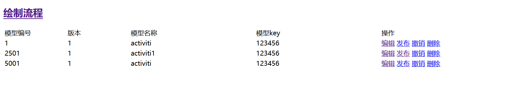
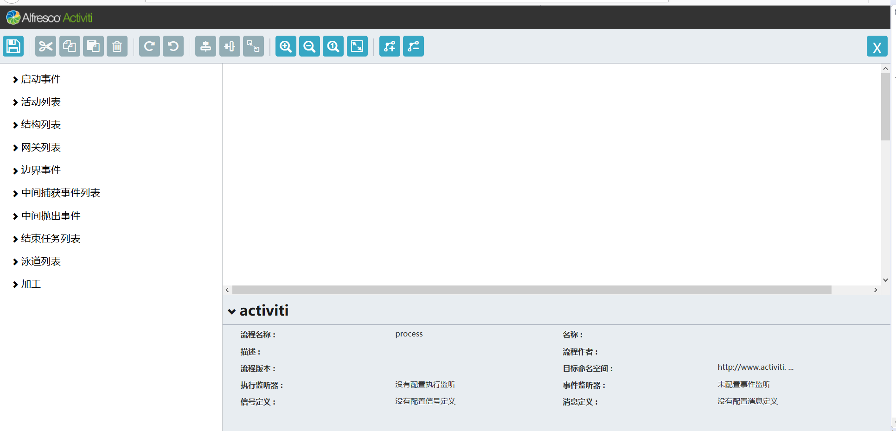

# cpss-designer
spring boot 1.5.8整合Activiti6.0及其Activiti-modeler

启动项目注意事项：  
1、修改yml文件数据库地址及其用户名、密码。  
2、默认启动端口为8080。  
3、访问地址：localhost:8080

# Make Project
mvn package

# Run
java -jar ./target/activiti6-demo-1.0.0.jar

